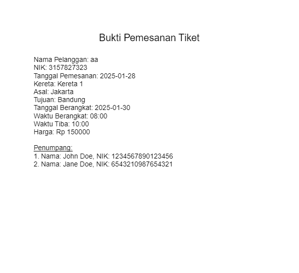

# **Endpoint** Documentation

## User
### User Register

**Endpoint**: ``api/user/register``

**Method**: ``POST``

**Request Body**
```json
{
  "username": "username",
  "password": "password",
  "email": "aa@email.com",
  "nama": "aa",
  "alamat": "alamat",
  "telp": "123",
  "nik": "123"
}
```
if email contain petugas.com, the role will be petugas

**Response Body**
```json
{
    "id": 1,
    "username": "username",
    "password": "hashedpassword",
    "email": "aa@email.com",
    "role": "pelanggan",
    "nama": "aa",
    "alamat": "SMK Telkom",
    "telp": "123",
    "nik": "123"
}
```

### Login User

**Endpoint**: ``api/user/login

**Method**: **``POST``**

**Request Body**
```json
{
    "email":"aa@email.com",
    "password":"password"
}
```

**Response Body**
```json
{
    "token": "token",
    "message": "Selamat datang, aa! Anda masuk sebagai pelanggan."
}
```

### Edit Profile

**Endpoint**: `api/user/editProfile`

**Method**: `PATCH`

**Header**
- **Authorization**: Bearer Token
  - Role: petugas

**Request Body**
```json
{
  "username": "new_username",
  "nama": "new_name",
  "alamat": "new_address",
  "telp": "new_phone",
  "userId": 2
}
```

- The `userId` is optional and can only be used by users with the role `petugas`. If not provided, the user's own profile will be updated.
- At least one of the fields (`username`, `nama`, `alamat`, `telp`) must be included.

**Response Body**
```json
{
  "id": 1,
  "username": "new_username",
  "nama": "new_name",
  "alamat": "new_address",
  "telp": "new_phone",
  "role": "pelanggan",
  "email": "user@example.com"
}
```


### Get User Profile

**Endpoint**: `api/user/profile`

**Method**: `GET`

**Header**
- **Authorization**: Bearer Token
  - Role: petugas

**Request Query Parameters**
- `userId` (optional): The ID of the user to fetch.
- `username` (optional): The username of the user to fetch.

If no query parameters are provided, all users will be fetched.

**Response Body**
- For a single user (by `userId` or `username`):
```json
{
  "id": 1,
  "username": "sampleuser",
  "nama": "Sample Name",
  "telp": "1234567890"
}
```
- For all users:
```json
[
  {
    "id": 1,
    "username": "sampleuser",
    "nama": "Sample Name",
    "telp": "1234567890"
  },
  {
    "id": 2,
    "username": "anotheruser",
    "nama": "Another Name",
    "telp": "0987654321"
  }
]
```

### Get Profile by Username

**Endpoint**: `api/user/profile?username=<username>`

**Method**: `GET`

**Request Query Parameters**
- `username` (required): The username of the user to fetch.

**Response Body**
```json
{
  "id": 1,
  "username": "sampleuser",
  "nama": "Sample Name",
  "telp": "1234567890"
}
```


## Kereta
### Create Kereta

**Endpoint**: ``api/kereta/create``

**Method**: **``POST``**

**Header**
- **Authorization**: Bearer Token
  - Role: petugas


**Request Body**
```json
{
    "namaKereta":"Kereta",
    "deskripsi":"Kereta",
    "kelas":"Ekonomi"
}
```

**Response Body**
```json
{
    "kereta": {
        "id": 1,
        "namaKereta": "Kereta",
        "deskripsi": "Kereta",
        "kelas": "Ekonomi"
    }
}
```

### Get Kereta
Get all
**Endpoint**: `api/kereta`

Get by id
**Endpoint**: `api/kereta/{id}`

**Method**: ``GET``

**Get all Response Body**
```json
{
    "kereta": [
        {
            "id": 1,
            "namaKereta": "Kereta",
            "deskripsi": "Kereta",
            "kelas": "Ekonomi"
        },
        more data...
    ]
}
```

**Get by id Response Body**
```json
{
    "kereta": {
        "id": 1,
        "namaKereta": "Kereta",
        "deskripsi": "Kereta",
        "kelas": "Ekonomi"
    }
}
```

### Update Kereta

**Endpoint**: `api/kereta/update?`

**Method**: `PUT`

**Header**
- **Authorization**: Bearer Token
  - Role: petugas


**Query Parameter**
- `id`: id kereta (`number`)

**Request Body**
```json
{
    "namaKereta":"Kereta1"
}
```

**Response Body**
```json
{
    "kereta": {
        "id": 1,
        "namaKereta": "Kereta1",
        "deskripsi": "Kereta",
        "kelas": "Ekonomi"
    }
}
```

### Delete Kereta

**Endpoint**: `api/kereta/delete?`
**Method**: ``DELETE``

**Header**
- **Authorization**: Bearer Token
  - Role: petugas


**Query Parameter**
- `id`: id kereta (`number`)


**Response Body**
```json
{
    "message": "Data deleted successfully",
    "data": {
        "id": 1,
        "namaKereta": "Kereta",
        "deskripsi": "Kereta",
        "kelas": "Ekonomi"
    }
}
```

## Gerbong
### Create Gerbong

**Endpoint**: `api/gerbong/create`

**Method**: ``POST``

**Header**
- **Authorization**: Bearer Token
  - Role: petugas


**Request Body**
```json
{
    "namaGerbong":"Gerbong 1",
    "kuota": 120,
    "keretaId":1
}
```

**Response Body**
```json
{
    "gerbong": {
        "id": 1,
        "nama": "Gerbong 1",
        "kuota": 120,
        "keretaId": 1
    }
}
```

### Get Gerbong
Get all
**Endpoint**: `api/gerbong`

Get by id
**Endpoint**: `api/gerbong/{id}`

**Method**: ``GET``

Get all **Response Body**
```json
{
    "gerbong": [
        {
            "id": 1,
            "nama": "Gerbong 1",
            "kuota": 120,
            "keretaId": 1
        }
        more data...
    ]
}
```

Get by id **Response Body**
```json
{
    "gerbong": {
        "id": 1,
        "nama": "Gerbong 1",
        "kuota": 120,
        "keretaId": 1
    }
}
```

### Update Gerbong

**Endpoint**: `api/gerbong/update?`

**Method**: ``PUT``

**Header**
- **Authorization**: Bearer Token
  - Role: petugas


**Query Parameter**
- `id`: id kereta (`number`)

**Request Body**
```json
{
    "namaGerbong":"Gerbong 2"
}
```

**Response Body**
```json
{
    "gerbong": {
        "id": 1,
        "nama": "Gerbong 2",
        "kuota": 120,
        "keretaId": 1
    }
}
```

### Delete Gerbong

**Endpoint**: `api/gerbong/delete?`

**Method**: ``DELETE``

**Header**
- **Authorization**: Bearer Token
  - Role: petugas


**Query Parameter**
- `id`: id kereta (`number`)

**Response Body**
```json
{
    "message": "Data deleted successfully",
    "data": {
        "id": 1,
        "nama": "Gerbong 1",
        "kuota": 120,
        "keretaId": 1
    }
}
```

## Kursi
### Create Kursi

**Endpoint**: ``api/kursi/create``

**Method**: ``POST``

**Header**
- **Authorization**: Bearer Token
  - Role: petugas

**Request Body**
```json
{
    "nomorKursi":"1",
    "gerbongId":1
}
```

**Response Body**
```json
{
    "id": 1,
    "nomorKursi": "1",
    "gerbongId": 1
}
```

### Get Kursi
Get all
**Endpoint**: `api/kursi`

Get by id
**Endpoint**: `api/kursi/{id}`

**Method**: ``GET``

Get all **Response Body**
```json
{
    "kursi": [
        {
            "id": 1,
            "nomorKursi": "1",
            "gerbongId": 1
        },
        more data...
    ]
}
```

Get by id **Response Body**
```json
{
    "kursi": {
        "id": 1,
        "nomorKursi": "1",
        "gerbongId": 1
    }
}
```

### Update Kursi

**Endpoint**: `api/kursi/update?`

**Method**: ``PUT``

**Header**
- **Authorization**: Bearer Token
  - Role: petugas


**Query Parameter**
- `id`: id kereta (`number`)

**Request Body**
```json
{
    "nomorKursi":"2"
}
```

**Response Body**
```json
{
    "id": 1,
    "nomorKursi": "2",
    "gerbongId": 1
}
```

### Delete Kursi

**Endpoint**: `api/kursi/delete?`

**Method**: ``DELETE``

**Header**
- **Authorization**: Bearer Token
  - Role: petugas


**Query Parameter**
- `id`: id kereta (`number`)

**Response Body**
```json
{
    "message": "Data deleted successfully",
    "data": {
        "id": 1,
        "nomorKursi": "2",
        "gerbongId": 1
    }
}
```

## Jadwal
### Create Jadwal

**Endpoint**: ``api/jadwal/create``

**Method**: **``POST``**

Request Header:
Bearer Token, Role petugas

Request Body
```json
{
    "id": 1,
    "keretaId": 1,
    "waktuBerangkat": "08:00",
    "waktuTiba": "10:00",
    "stasiunBerangkat": "Jakarta",
    "stasiunTiba": "Bandung",
    "asalKeberangkatan": "Jakarta",
    "tujuanKeberangkatan": "Bandung",
    "tanggalBerangkat": "2025-01-30T08:00:00.000Z",
    "tanggalKedatangan": "2025-01-30T10:00:00.000Z",
    "harga": 150000,
    "kuota": 100
}
```

Response Body
```json
{
    "id": 5,
    "keretaId": 3,
    "waktuBerangkat": "08:00",
    "waktuTiba": "10:00",
    "stasiunBerangkat": "Jakarta",
    "stasiunTiba": "Bandung",
    "asalKeberangkatan": "Jakarta",
    "tujuanKeberangkatan": "Bandung",
    "tanggalBerangkat": "2025-01-30T08:00:00.000Z",
    "tanggalKedatangan": "2025-01-30T10:00:00.000Z",
    "harga": 150000,
    "kuota": 100
}
```

### Get Jadwal
Get all
**Endpoint**: `api/jadwal`

Get by id
**Endpoint**: `api/kursi/{id}`

**Method**: ``GET``

Get all **Response Body**

```json
{
    "jadwal": [
    {
        "id": 1,
        "keretaId": 1,
        "waktuBerangkat": "08:00",
        "waktuTiba": "10:00",
        "stasiunBerangkat": "Jakarta",
        "stasiunTiba": "Bandung",
        "asalKeberangkatan": "Jakarta",
        "tujuanKeberangkatan": "Bandung",
        "tanggalBerangkat": "2025-01-30T08:00:00.000Z",
        "tanggalKedatangan": "2025-01-30T10:00:00.000Z",
        "harga": 150000,
        "kuota": 100,
        "kereta": {
            "id": 1,
            "namaKereta": "Kereta",
            "deskripsi": "Kereta",
            "kelas": "Ekonomi"
        }
    },
        more data...
    ]
}
```

Get by id **Response Body**
```json
{
    "id": 1,
    "keretaId": 1,
    "waktuBerangkat": "08:00",
    "waktuTiba": "10:00",
    "stasiunBerangkat": "Jakarta",
    "stasiunTiba": "Bandung",
    "asalKeberangkatan": "Jakarta",
    "tujuanKeberangkatan": "Bandung",
    "tanggalBerangkat": "2025-01-30T08:00:00.000Z",
    "tanggalKedatangan": "2025-01-30T10:00:00.000Z",
    "harga": 150000,
    "kuota": 100,
    "kereta": {
        "id": 1,
        "namaKereta": "Kereta",
        "deskripsi": "Kereta",
        "kelas": "Ekonomi"
    }
}
```

### Update Jadwal

**Endpoint**: `api/jadwal/update?`

**Method**: ``PUT``

**Header**
- **Authorization**: Bearer Token
  - Role: petugas


**Query Parameter**
- `id`: id kereta (`number`)

**Request Body**
```json
{
    "waktuBerangkat": "09:00",
    "harga": 1
}
```

**Response Body**
```json
    "id": 1,
    "keretaId": 1,
    "waktuBerangkat": "09:00",
    "waktuTiba": "10:00",
    "stasiunBerangkat": "Jakarta",
    "stasiunTiba": "Bandung",
    "asalKeberangkatan": "Jakarta",
    "tujuanKeberangkatan": "Bandung",
    "tanggalBerangkat": "2025-01-30T08:00:00.000Z",
    "tanggalKedatangan": "2025-01-30T10:00:00.000Z",
    "harga": 1,
    "kuota": 100,
    "kereta": {
        "id": 1,
        "namaKereta": "Kereta",
        "deskripsi": "Kereta",
        "kelas": "Ekonomi"
    }
```

### Delete Jadwal

**Endpoint**: ``api/jadwal/delete?``

**Method**: ``DELETE``

**Header**
- **Authorization**: Bearer Token
  - Role: petugas


**Query Parameter**
- `id`: id kereta (`number`)

**Response Body**
```json
{
{
    "message": "Deleted successfully",
    "data": {
        "id": 1,
        "keretaId": 1,
        "waktuBerangkat": "08:00",
        "waktuTiba": "10:00",
        "stasiunBerangkat": "Jakarta",
        "stasiunTiba": "Bandung",
        "asalKeberangkatan": "Jakarta",
        "tujuanKeberangkatan": "Bandung",
    "tanggalBerangkat": "2025-01-30T08:00:00.000Z",
    "tanggalKedatangan": "2025-01-30T10:00:00.000Z",
        "harga": 150000,
        "kuota": 100
    }
}
}
```


## Tiket

### Pesan
**Endpoint**: `api/tiket/pesan`

**Method**: ``POST``

**Header**
- **Authorization**: Bearer Token
  - Role: pelanggan

**Request Body**
```json
{
  "jadwalId": 1,
  "penumpang": [
    {
      "nama": "John Doe",
      "nik": "1234567890123456"
    },
    {
      "nama": "Jane Doe",
      "nik": "6543210987654321"
    }
  ]
}
```

**Response Body**



### Lihat Transaksi
**Endpoint**: `/api/tiket/transaksi`

**Method**: `GET`

**Header**
- **Authorization**: Bearer Token
  - Role: pelanggan

**Query Parameters** (opsional):  
- `tanggal`: hari spesifik (format: `DD`)  
- `bulan`: bulan tertentu (format: `MM`)  
- `tahun`: tahun tertentu (format: `YYYY`)  

**Contoh Query**:
- `/api/tiket/transaksi?tanggal=15&bulan=01&tahun=2025`
- `/api/tiket/transaksi?tahun=2025`

**Response Body**:
```json
[
  {
    "id": 1,
    "tanggal": "2025-01-15",
    "pelanggan": {
      "nama": "John Doe",
      "nik": "1234567890123456"
    },
    "jadwal": {
      "kereta": "Argo Parahyangan",
      "tanggalBerangkat": "2025-01-15",
      "tanggalKedatangan": "2025-01-15"
    },
    "penumpang": [
      {
        "nama": "Jane Doe",
        "nik": "9876543210987654"
      },
      {
        "nama": "John Doe",
        "nik": "1234567890123456"
      }
    ]
  },
  more data...
]
```

### Lihat Rekap Pemasukan
**Endpoint**: `/api/tiket/rekap`

**Method**: `GET`

**Request Header**:  
- Bearer Token  
- Role: petugas

**Query Parameters**:  
- `bulan` (required): Bulan dalam format angka (1–12).  
- `tahun` (required): Tahun dalam format 4 digit (e.g., 2025).

**Contoh Query**:  
- `/api/tiket/rekap?bulan=01&tahun=2025`

---

**Response Body**:  
```json
{
  "bulan": "January 2025",
  "totalPemasukan": 5000000
}
```

### History Transaksi Tiket

**Endpoint**: `api/tiket/history`

**Method**: ``GET``

**Header**
- **Authorization**: Bearer Token
  - Role: pelanggan

**Response Body**
```json
[
  {
    "id": 1,
    "tanggal": "2025-01-15",
    "jadwal": {
      "kereta": "Argo Bromo",
      "waktuBerangkat": "08:00",
      "waktuTiba": "12:00",
      "stasiunBerangkat": "Jakarta",
      "stasiunTiba": "Surabaya",
      "asalKeberangkatan": "Jakarta",
      "tujuanKeberangkatan": "Surabaya",
      "tanggalBerangkat": "2025-01-15",
      "tanggalKedatangan": "2025-01-15"
    },
    "penumpang": [
      {
        "nama": "John Doe",
        "nik": "1234567890123456"
      },
      {
        "nama": "Jane Doe",
        "nik": "6543210987654321"
      }
    ]
  }
]